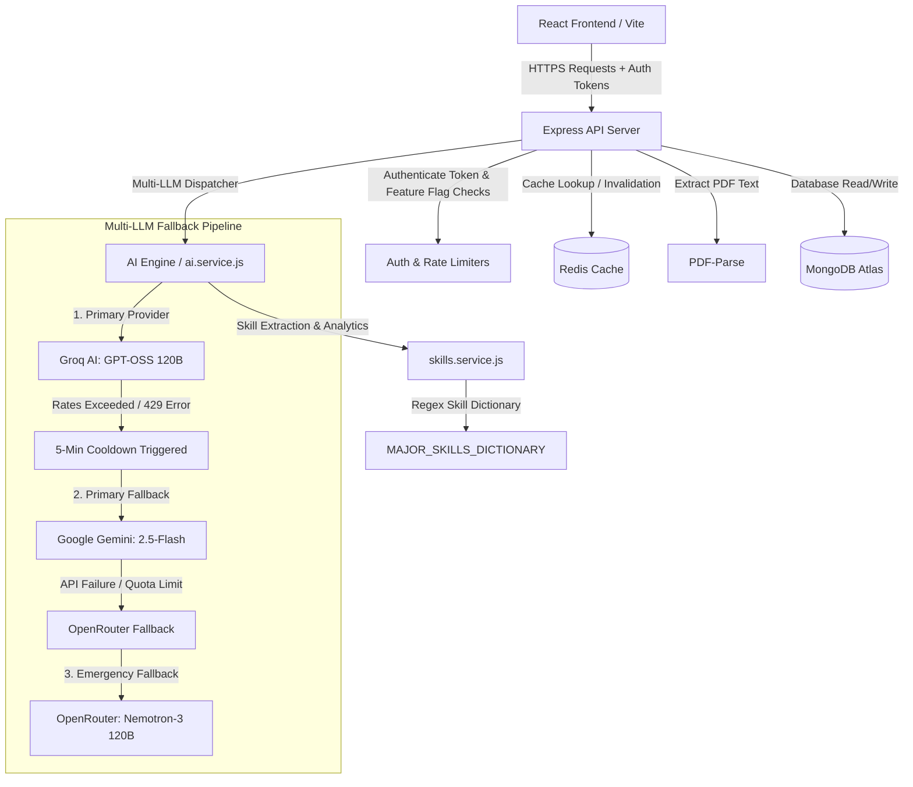
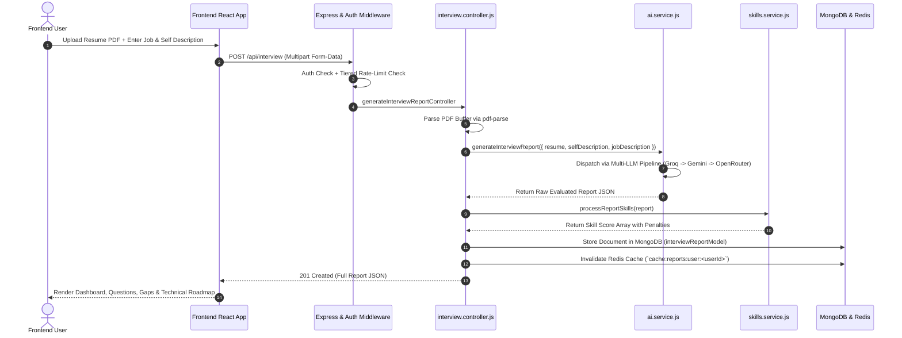

# KIVI-AI Platform — Technical Architecture & Development Manual

> **Quick Overview**: This document serves as the authoritative blueprint for the **KIVI-AI Platform** (AI Technical Interviewer & ATS Resume Studio). It details how the AI pipeline works, the exact multi-LLM evaluation flow, caching layer, and a comprehensive file-to-task directory map for rapid onboarding and quick reviews.

---

## 1. Executive Summary & High-Level Architecture

The **KIVI-AI Platform** is an end-to-end AI-powered career accelerator designed for software engineers. It evaluates candidate resumes against target job descriptions, generates tailored mock technical & behavioral interviews, computes real-time skill gap analytics, generates ATS-friendly A4 resumes, creates custom cover letters, and features an interactive AI Resume Copilot.



---

## 2. AI Engine Architecture & Multi-LLM Resilience

All AI capabilities are centralized in [`Backend/src/services/ai.service.js`](file:///c:/Users/Sumit/Desktop/Sumit_Data/Resume%20Generator/Backend/src/services/ai.service.js). The engine implements a zero-downtime, multi-provider fallback strategy with automatic health monitoring.

### 2.1 Multi-LLM Fallback Pipeline

| Priority | Provider | Model | Condition / Trigger |
| :--- | :--- | :--- | :--- |
| **Primary** | **Groq AI** | `openai/gpt-oss-120b` | Tried first whenever `isGroqHealthy === true` |
| **Fallback 1** | **Google Gemini** | `gemini-2.5-flash` | Activated if Groq fails or enters cooldown |
| **Fallback 2** | **OpenRouter** | `nvidia/nemotron-3-super-120b-a12b:free` | Activated if both Groq and Gemini fail |

### 2.2 Dynamic Circuit-Breaker & Cooldown Tracking
- **Cooldown Trigger**: If Groq returns an `HTTP 429` rate-limit error, `isGroqHealthy` is toggled to `false`, and `groqLastFailureTime` records the timestamp.
- **Auto-Recovery**: Every call to `callGroq()` checks if `GROQ_COOLDOWN_MS` (5 minutes) has elapsed. Once passed, the engine attempts Groq again automatically.

### 2.3 JSON Normalization & Schema Enforcement
LLMs are instructed via strict System Prompts to respond **only in valid raw JSON**. Responses pass through:
1. `extractJsonFromText(text)`: Regex extraction removing markdown fences (```json ... ```) or stray outer commentary.
2. Zod Validation Schemas:
   - `aiInterviewReportSchema`: Validates report structure (developer title, match score 0-100, 5 technical questions, 5 behavioral questions, skill gaps, preparation plan).
   - `mongooseInterviewReportSchema`: Validates data types before MongoDB insertion.
3. Fallback Normalizers (`normalizeInterviewReport`, `normalizeQuestionArray`, `normalizeSkillGapArray`): Safeguard against malformed array/object shapes to prevent system crashes.

---

## 3. End-to-End Evaluation & Report Flow



### Detailed Evaluation Steps:
1. **PDF Text Extraction**: [`pdf-parse`](file:///c:/Users/Sumit/Desktop/Sumit_Data/Resume%20Generator/Backend/src/controller/interview.controller.js#L24) parses raw text from uploaded resume buffer.
2. **Prompts Engineering**:
   - Role: Expert HR IT Manager with 10+ years experience.
   - Outputs Required:
     - `matchScore`: Calculated candidate job readiness score (0–100%).
     - `developerTitle`: Tailored target developer title (e.g., "Full-Stack React Developer").
     - `technicalQuestions`: 5 practical, technical questions with intent analysis and interview-ready sample answers.
     - `behavioralQuestion`: 5 behavioral questions focusing on STAR-method communication, leadership, and problem-solving.
     - `skillGaps`: Explicit missing skills labeled with `low`, `medium`, or `high` severity.
     - `preparationPlan`: Day-by-day actionable revision roadmap.
3. **Skill Analytics & Penalty Logic ([`skills.service.js`](file:///c:/Users/Sumit/Desktop/Sumit_Data/Resume%20Generator/Backend/src/services/skills.service.js))**:
   - Scans full text against `MAJOR_SKILLS_DICTIONARY` canonical list.
   - Calculates specific skill mastery percentages: `Skill Score = Math.max(30, Math.min(100, overallMatchScore - penalty))` where severity penalties are **High: -35%**, **Medium: -20%**, **Low: -10%**.
4. **Caching & Storage**: Saved to MongoDB (`interviewReport.model.js`); user Redis report list cache is automatically invalidated.

---

## 4. Key Platform Features & AI Subsystems

### 4.1 AI ATS Resume Studio (`generateResumeHtml`)
- **Location**: [`ai.service.js`](file:///c:/Users/Sumit/Desktop/Sumit_Data/Resume%20Generator/Backend/src/services/ai.service.js#L664) & [`Resume.jsx`](file:///c:/Users/Sumit/Desktop/Sumit_Data/Resume%20Generator/Frontend/src/features/Interview/pages/Resume.jsx)
- **Functionality**: Transforms candidate background into a ATS-optimized single-column A4 resume HTML.
- **Client-Side Live Editing & PDF Export**: Candidates edit the resume directly inside a live A4 simulated editor in the browser and export 1:1 PDFs via `window.print()` and CSS print media rules.

### 4.2 AI Cover Letter Generator (`generateCoverLetter`)
- **Location**: [`coverletter.controller.js`](file:///c:/Users/Sumit/Desktop/Sumit_Data/Resume%20Generator/Backend/src/controller/coverletter.controller.js) & [`CoverLetter.jsx`](file:///c:/Users/Sumit/Desktop/Sumit_Data/Resume%20Generator/Frontend/src/features/Interview/pages/CoverLetter.jsx)
- **Functionality**: Generates print-ready A4 HTML cover letters tailored to specific company names and roles, connecting resume strengths to key job description requirements.

### 4.3 Interactive KIVI AI Copilot (`rewriteResumeSection`)
- **Location**: [`ai.service.js`](file:///c:/Users/Sumit/Desktop/Sumit_Data/Resume%20Generator/Backend/src/services/ai.service.js#L841)
- **Functionality**: Floating AI assistant supporting live highlighted text re-writing (`enhance`, `shorten`, `fix_grammar`, `align_job`) or answering candidate questions regarding platform capabilities and career advice.

---

## 5. Comprehensive Project File Map

### 5.1 Backend File Map ([`Backend/src/`](file:///c:/Users/Sumit/Desktop/Sumit_Data/Resume%20Generator/Backend/src))

| File Path | Primary Responsibility | Key Functions / Exports |
| :--- | :--- | :--- |
| [`app.js`](file:///c:/Users/Sumit/Desktop/Sumit_Data/Resume%20Generator/Backend/src/app.js) | Express app initialization, CORS configuration, global error handler, route registration | Mounts `/api/auth`, `/api/interview`, `/api/cover-letter`, `/api/admin`, `/api/notifications` |
| [`server.js`](file:///c:/Users/Sumit/Desktop/Sumit_Data/Resume%20Generator/Backend/src/server.js) | Server startup script | Connects DB (`connectToDb`), connects Redis (`connectToRedis`), listens on PORT |
| [`config/db.js`](file:///c:/Users/Sumit/Desktop/Sumit_Data/Resume%20Generator/Backend/src/config/db.js) | MongoDB Connection handler | `connectToDb()` |
| [`config/redis.js`](file:///c:/Users/Sumit/Desktop/Sumit_Data/Resume%20Generator/Backend/src/config/redis.js) | ioredis initialization & connection management | `connectToRedis()`, `getRedisClient()` |
| [`services/ai.service.js`](file:///c:/Users/Sumit/Desktop/Sumit_Data/Resume%20Generator/Backend/src/services/ai.service.js) | Core AI pipeline & Multi-LLM provider failover | `generateInterviewReport()`, `generateResumeHtml()`, `generateCoverLetter()`, `rewriteResumeSection()`, `getAIStatus()` |
| [`services/redis.service.js`](file:///c:/Users/Sumit/Desktop/Sumit_Data/Resume%20Generator/Backend/src/services/redis.service.js) | Key-value caching layer wrapper | `getCache()`, `setCache()`, `deleteCache()`, `clearCacheByPrefix()` |
| [`services/skills.service.js`](file:///c:/Users/Sumit/Desktop/Sumit_Data/Resume%20Generator/Backend/src/services/skills.service.js) | Tech stack regex extraction & skill analytics engine | `extractMajorSkillsFromText()`, `processReportSkills()`, `aggregateSkillAnalytics()` |
| [`controller/interview.controller.js`](file:///c:/Users/Sumit/Desktop/Sumit_Data/Resume%20Generator/Backend/src/controller/interview.controller.js) | Interview & Resume request handling logic | `generateInterviewReportController()`, `getInterviewReportByIdController()`, `getAllInterviewReportController()`, `getSkillAnalyticsController()`, `updateResumeHtmlController()`, `updateInterviewProgressController()`, `rewriteResumeSectionController()` |
| [`controller/coverletter.controller.js`](file:///c:/Users/Sumit/Desktop/Sumit_Data/Resume%20Generator/Backend/src/controller/coverletter.controller.js) | Cover Letter API controller | `createCoverLetterController()`, `getCoverLetterByIdController()`, `getAllCoverLettersController()`, `deleteCoverLetterByIdController()` |
| [`controller/auth.controller.js`](file:///c:/Users/Sumit/Desktop/Sumit_Data/Resume%20Generator/Backend/src/controller/auth.controller.js) | Authentication, JWT, profile management | `registerUser()`, `loginUser()`, `logoutUser()`, `getProfile()`, `forgotPassword()`, `resetPassword()` |
| [`controller/admin.controller.js`](file:///c:/Users/Sumit/Desktop/Sumit_Data/Resume%20Generator/Backend/src/controller/admin.controller.js) | Admin panel controls & user management | `getAllUsers()`, `updateUserPlan()`, `updateFeaturePermissions()`, `getAdminDashboardStats()` |
| [`routes/interview.route.js`](file:///c:/Users/Sumit/Desktop/Sumit_Data/Resume%20Generator/Backend/src/routes/interview.route.js) | Interview REST API endpoints & route-level limiters | Endpoints for report generation, analytics, PDF generation, AI copilot |
| [`routes/auth.route.js`](file:///c:/Users/Sumit/Desktop/Sumit_Data/Resume%20Generator/Backend/src/routes/auth.route.js) | Authentication endpoints | `/register`, `/login`, `/logout`, `/profile`, `/verify-otp` |
| [`routes/coverletter.route.js`](file:///c:/Users/Sumit/Desktop/Sumit_Data/Resume%20Generator/Backend/src/routes/coverletter.route.js) | Cover letter endpoints | `/create`, `/all`, `/:coverLetterId` |
| [`routes/admin.route.js`](file:///c:/Users/Sumit/Desktop/Sumit_Data/Resume%20Generator/Backend/src/routes/admin.route.js) | Admin management endpoints | Protected by `authAdmin` middleware |
| [`middleware/auth.middleware.js`](file:///c:/Users/Sumit/Desktop/Sumit_Data/Resume%20Generator/Backend/src/middleware/auth.middleware.js) | JWT verification & token blacklist checking | `authUser`, `authAdmin` |
| [`middleware/rateLimiter.middleware.js`](file:///c:/Users/Sumit/Desktop/Sumit_Data/Resume%20Generator/Backend/src/middleware/rateLimiter.middleware.js) | Tier-based and global Redis rate limiters | `createRateLimiter()`, `createTieredRateLimiter()` |
| [`middleware/file.middleware.js`](file:///c:/Users/Sumit/Desktop/Sumit_Data/Resume%20Generator/Backend/src/middleware/file.middleware.js) | Multer memory storage & PDF validation | `upload.single('resume')` |
| [`models/interviewReport.model.js`](file:///c:/Users/Sumit/Desktop/Sumit_Data/Resume%20Generator/Backend/src/models/interviewReport.model.js) | Mongoose Schema for stored interview evaluation | Defines developerTitle, matchScore, technicalQuestions, behavioralQuestion, skillGaps, detectedSkills, preparationPlan, generatedResumeHtml |
| [`models/user.model.js`](file:///c:/Users/Sumit/Desktop/Sumit_Data/Resume%20Generator/Backend/src/models/user.model.js) | Mongoose Schema for User profile & subscription plan | Defines user fields, subscription Tier (free/pro/premium), blockedFeatures |
| [`constants/skills.constants.js`](file:///c:/Users/Sumit/Desktop/Sumit_Data/Resume%20Generator/Backend/src/constants/skills.constants.js) | Canonical dictionary of tech skills and aliases | `MAJOR_SKILLS_DICTIONARY` |

---

### 5.2 Frontend File Map ([`Frontend/src/`](file:///c:/Users/Sumit/Desktop/Sumit_Data/Resume%20Generator/Frontend/src))

| File Path | Primary Responsibility | Key Components / Logic |
| :--- | :--- | :--- |
| [`App.jsx`](file:///c:/Users/Sumit/Desktop/Sumit_Data/Resume%20Generator/Frontend/src/App.jsx) | Main React App component | Renders router provider (`app.routes.jsx`) |
| [`app.routes.jsx`](file:///c:/Users/Sumit/Desktop/Sumit_Data/Resume%20Generator/Frontend/src/app.routes.jsx) | Client-side routing configuration | Defines public and protected routes for Home, Interview, Resume, CoverLetter, AllReports, Admin |
| [`features/Interview/interview.context.jsx`](file:///c:/Users/Sumit/Desktop/Sumit_Data/Resume%20Generator/Frontend/src/features/Interview/interview.context.jsx) | React Context for Interview state | Provides `report`, `reports`, `loading`, `setReport`, `setReports` state across interview views |
| [`features/Interview/hooks/useInterview.js`](file:///c:/Users/Sumit/Desktop/Sumit_Data/Resume%20Generator/Frontend/src/features/Interview/hooks/useInterview.js) | Custom React hook encapsulating interview API calls | Exports `generateReport()`, `getReoprtById()`, `getReports()`, `getSkillsStats()`, `updateNewResume()`, `deleteReport()` |
| [`features/Interview/services/interview.api.js`](file:///c:/Users/Sumit/Desktop/Sumit_Data/Resume%20Generator/Frontend/src/features/Interview/services/interview.api.js) | Axios API interface for Interview backend | Handles HTTP calls to `/api/interview/*` with credential handling |
| [`features/Interview/pages/Home.jsx`](file:///c:/Users/Sumit/Desktop/Sumit_Data/Resume%20Generator/Frontend/src/features/Interview/pages/Home.jsx) | Main Landing Page & Report Generator Form | Drag & drop PDF upload, Job Description inputs, triggers report generation |
| [`features/Interview/pages/Interview.jsx`](file:///c:/Users/Sumit/Desktop/Sumit_Data/Resume%20Generator/Frontend/src/features/Interview/pages/Interview.jsx) | Interview Report Master View | Displays Match Score, Top Skill Gaps, navigation tabs (Technical, Behavioral, Roadmap) |
| [`features/Interview/pages/TechnicalQuestionsTab.jsx`](file:///c:/Users/Sumit/Desktop/Sumit_Data/Resume%20Generator/Frontend/src/features/Interview/pages/TechnicalQuestionsTab.jsx) | Technical Interview Questions tab | Accordion display of questions, intention analysis, sample answer toggle, and user self-practice response recording |
| [`features/Interview/pages/BehavioralQuestionsTab.jsx`](file:///c:/Users/Sumit/Desktop/Sumit_Data/Resume%20Generator/Frontend/src/features/Interview/pages/BehavioralQuestionsTab.jsx) | Behavioral Questions tab | Render STAR-method questions, real-life scenario tips, and interview guidance |
| [`features/Interview/pages/TechnicalRoadmapTab.jsx`](file:///c:/Users/Sumit/Desktop/Sumit_Data/Resume%20Generator/Frontend/src/features/Interview/pages/TechnicalRoadmapTab.jsx) | Actionable Preparation Roadmap tab | Day-by-day revision schedule with focus areas and interactive completion checkboxes |
| [`features/Interview/pages/Resume.jsx`](file:///c:/Users/Sumit/Desktop/Sumit_Data/Resume%20Generator/Frontend/src/features/Interview/pages/Resume.jsx) | ATS Resume Studio & Live A4 Sheet Editor | Renders live editable A4 document, triggers AI section re-writing, PDF print view |
| [`features/Interview/pages/CoverLetter.jsx`](file:///c:/Users/Sumit/Desktop/Sumit_Data/Resume%20Generator/Frontend/src/features/Interview/pages/CoverLetter.jsx) | Cover Letter Studio page | Form for company/role details, AI generation, and live A4 document editor |
| [`features/Interview/pages/AllReports.jsx`](file:///c:/Users/Sumit/Desktop/Sumit_Data/Resume%20Generator/Frontend/src/features/Interview/pages/AllReports.jsx) | Candidate History & Skill Analytics Dashboard | Visual bar graphs of skill scores, historical report list, filter & search features |
| [`features/Auth/auth.context.jsx`](file:///c:/Users/Sumit/Desktop/Sumit_Data/Resume%20Generator/Frontend/src/features/Auth/auth.context.jsx) | Authentication Context | Manages user session, login status, JWT token persistence, and profile data |

---

## 6. Database & Caching Architecture

### 6.1 Database Schema Overview (MongoDB)
- **`InterviewReport`**:
  - `user`: ObjectId (ref: User)
  - `developerTitle`: String
  - `matchScore`: Number (0 - 100)
  - `technicalQuestions`: Array of `{ question, intention, answer, userResponse }`
  - `behavioralQuestion`: Array of `{ question, intention, answer, userResponse }`
  - `skillGaps`: Array of `{ skill, severity: 'low'|'medium'|'high' }`
  - `detectedSkills`: Array of `{ name, category, score }`
  - `preparationPlan`: Array of `{ day, focus, tasks }`
  - `generatedResumeHtml`: String (Persisted HTML resume markup)

### 6.2 Caching Strategy & Environment Separation (Redis)
- **Localhost Development**: Uses local Docker container (`redis://127.0.0.1:6379`) or `LOCAL_REDIS_URL`. If local Docker is not running, the application gracefully operates in **In-Memory Fallback Mode** via `memoryStore`.
- **Production Environment (Railway)**: Automatically connects to Railway's managed Redis instance via environment variables injected by Railway (`REDISHOST`, `REDISPASSWORD`, `REDISPORT`, `REDIS_URL`, `REDIS_PUBLIC_URL`).
- **Report Details Caching**: Cache Key `cache:report:<interviewId>:<userId>` (TTL: 3600 seconds / 1 hour).
- **User All Reports Summary**: Cache Key `cache:reports:user:<userId>` (TTL: 600 seconds / 10 minutes).
- **Cache Invalidation Triggers**: Automatically invalidated when a new report is created, updated, or deleted.

### 6.3 Unified Generation Credit Pool ("gen Credits")
All AI generation operations share a single, unified credit pool tracked via `fullGenerationLimiter` (`ratelimit:full-generation:user:<userId>`):
1. **Report Generation**: `POST /api/interview/` (Deducts 1 Gen Credit)
2. **Resume Regeneration**: `POST /api/interview/resume/pdf/:interviewReportId` (Deducts 1 Gen Credit)
3. **Cover Letter Generation**: `POST /api/cover-letter/` & `/generate-from-report/:interviewReportId` (Deducts 1 Gen Credit)

**Tier Credit Limits (30-Day Window)**:
- **Free Plan**: 2 Generation Credits
- **Pro Plan**: 10 Generation Credits
- **Premium Plan**: 25 Generation Credits
- Custom admin bonus credits (`customBonusCredits`) expand the maximum allowance automatically.

---

## 7. Key API Endpoints Reference

| Method | Endpoint | Description | Auth Required |
| :--- | :--- | :--- | :--- |
| `POST` | `/api/interview` | Upload resume PDF & generate new interview report | Yes |
| `GET` | `/api/interview/report/:interviewId` | Retrieve interview report by ID (Redis cached) | Yes |
| `GET` | `/api/interview` | Fetch all historical reports for logged-in user | Yes |
| `GET` | `/api/interview/skill-analytics` | Aggregated tech skill performance analytics | Yes |
| `POST` | `/api/interview/resume/pdf/:interviewReportId` | Generate or fetch persisted HTML resume | Yes |
| `PUT` | `/api/interview/update-resume-html/:interviewReportId` | Save user-edited resume HTML | Yes |
| `PUT` | `/api/interview/update-progress/:interviewId` | Save recorded candidate answers & roadmap tasks | Yes |
| `POST` | `/api/interview/rewrite-resume-section` | AI Copilot text re-writer & assistant query endpoint | Yes |
| `GET` | `/api/interview/model-info` | Returns current active LLM status | Yes |
| `DELETE` | `/api/interview/delete-report/:interviewReportId` | Delete specific interview report | Yes |

---

## 8. Quick Review & Troubleshooting Checklist

- **AI Calls Failing?**:
  1. Check `.env` for `GROQ_API_KEY`, `GOOGLE_GENAI_API_KEY`, and `OPENROUTER_API_KEY`.
  2. Hit `/api/interview/model-info` to verify active provider status. If Groq hit a rate limit, the service will fall back to Gemini or OpenRouter seamlessly.
- **Redis Connection Warnings?**:
  - If Redis is unavailable, the application gracefully operates in **Fallback Mode** (bypassing cache and querying MongoDB directly without throwing errors).
- **Resume Formatting / Page Overflow Issues?**:
  - Resumes are rendered client-side in an A4 container with `@media print` rules enforcing strict page breaks (`page-break-inside: avoid`). PDF generation is handled via browser `window.print()` for exact pixel fidelity.

---
*Created automatically for rapid developer review & AI context alignment.*
