# KIVI-AI — User Request Handling Architecture (Complete Deep-Dive)

> This document provides a comprehensive deep-dive into how every user request is handled on the KIVI-AI platform — covering Auth, APIs, LLM APIs, Payment Gateway, Caching, and Background Jobs.

---

## 📌 High-Level Architecture Overview

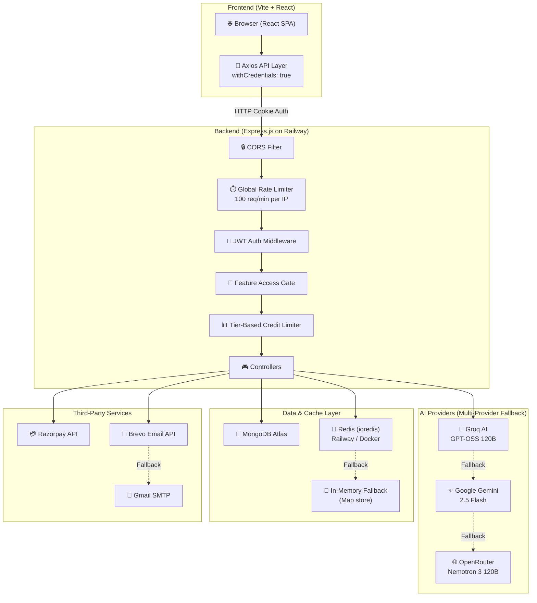

---

## 🗂️ Server Tech Stack — What's Currently Being Used

| Component | Technology | File Reference |
|---|---|---|
| **Runtime** | Node.js | — |
| **Web Framework** | Express.js v5.2.1 | [app.js](file:///c:/Users/Sumit/Desktop/Sumit_Data/Resume%20Generator/Backend/src/app.js) |
| **Database** | MongoDB (Mongoose v9.6.2) | [database.js](file:///c:/Users/Sumit/Desktop/Sumit_Data/Resume%20Generator/Backend/src/config/database.js) |
| **Cache / Rate Limit Store** | Redis (ioredis v6) + In-Memory Map fallback | [redis.js](file:///c:/Users/Sumit/Desktop/Sumit_Data/Resume%20Generator/Backend/src/config/redis.js) |
| **Authentication** | JWT (jsonwebtoken) + HttpOnly Cookies | [auth.middleware.js](file:///c:/Users/Sumit/Desktop/Sumit_Data/Resume%20Generator/Backend/src/middleware/auth.middleware.js) |
| **Password Hashing** | bcryptjs | [auth.controller.js](file:///c:/Users/Sumit/Desktop/Sumit_Data/Resume%20Generator/Backend/src/controller/auth.controller.js) |
| **Input Validation** | Zod v4.4.3 (AI response schemas) | [ai.service.js](file:///c:/Users/Sumit/Desktop/Sumit_Data/Resume%20Generator/Backend/src/services/ai.service.js) |
| **File Upload** | Multer (memory storage, 3MB max, PDF only) | [file.middleware.js](file:///c:/Users/Sumit/Desktop/Sumit_Data/Resume%20Generator/Backend/src/middleware/file.middleware.js) |
| **PDF Parsing** | pdf-parse v2.4.5 | [interview.controller.js](file:///c:/Users/Sumit/Desktop/Sumit_Data/Resume%20Generator/Backend/src/controller/interview.controller.js) |
| **Email** | Brevo HTTP API (primary) → Gmail SMTP → Console (dev) | [email.service.js](file:///c:/Users/Sumit/Desktop/Sumit_Data/Resume%20Generator/Backend/src/services/email.service.js) |
| **Payment Gateway** | Razorpay (REST API + Webhooks) | [razorpay.service.js](file:///c:/Users/Sumit/Desktop/Sumit_Data/Resume%20Generator/Backend/src/services/razorpay.service.js) |
| **AI / LLM** | Groq (primary) → Gemini (fallback) → OpenRouter (fallback) | [ai.service.js](file:///c:/Users/Sumit/Desktop/Sumit_Data/Resume%20Generator/Backend/src/services/ai.service.js) |
| **Hosting** | Railway (Backend) + Vercel (Frontend) | [railway.json](file:///c:/Users/Sumit/Desktop/Sumit_Data/Resume%20Generator/Backend/railway.json) |
| **Frontend** | Vite + React | [package.json](file:///c:/Users/Sumit/Desktop/Sumit_Data/Resume%20Generator/Frontend/package.json) |

---

## 🔐 1. Authentication & Authorization System

### 1.1 Request Flow — User Login/Register

```
========================= 1. REGISTRATION FLOW =========================
[User Form] ──► POST /api/auth/register
                      │
                      ▼
             [Rate Limit: 5/min]
                      │
                      ▼
         [Validate Email Domain DNS]
                      │
                      ▼
           [Duplicate User Check]
                      │
                      ├──► Exists: 400 Error
                      └──► New User: Create (isVerified = false)
                                  │
                                  ▼
                         [Store OTP in MongoDB (TTL 10m)]
                                  │
                                  ▼
                         [Send OTP via Brevo/Gmail]
                                  │
                                  ▼
                         [Frontend shows OTP Modal]

========================= 2. OTP VERIFICATION FLOW =====================
[User enters OTP] ──► POST /api/auth/verify-otp
                            │
                            ▼
               [Validate OTP in MongoDB (Age <= 600s)]
                            │
                            ├──► Invalid/Expired: 400 Error
                            └──► Valid: Set isVerified = true
                                        │
                                        ▼
                               [Generate JWT Token (24h)]
                                        │
                                        ▼
                               [Set HttpOnly Cookie: token=JWT] ──► 200 OK

========================= 3. LOGIN FLOW ================================
[User Login Form] ──► POST /api/auth/login
                            │
                            ▼
                   [Rate Limit: 5/min]
                            │
                            ▼
                   [Find User by Email in MongoDB]
                            │
                            ├──► Not Found: 400 Invalid Credentials
                            └──► Found: bcrypt.compare(password, hash)
                                        │
                                        ├──► Wrong: 400 Error
                                        └──► Match: Generate JWT
                                                    │
                                                    ▼
                                           [Set HttpOnly Cookie] ──► 200 OK
```

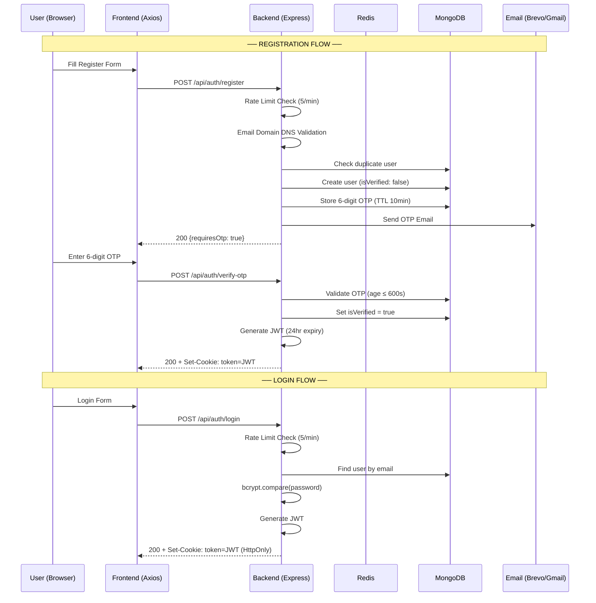

### 1.2 JWT Token Structure

```javascript
// JWT Payload (generated in auth.controller.js)
{
    id: user._id,
    username: user.username,
    plan: user.plan || 'free',    // 'free' | 'pro' | 'premium'
    role: user.role || 'user',     // 'user' | 'admin' | 'super_admin'
    isAdmin: boolean
}
// Expiry: 24 hours
// Signing: process.env.JWT_SECRET
```

### 1.3 Cookie Configuration

```javascript
const cookieOptions = {
    httpOnly: true,                                        // ✅ Not accessible via JavaScript (XSS safe)
    secure: process.env.NODE_ENV === "production",         // ✅ HTTPS only in prod
    sameSite: process.env.NODE_ENV === "production" ? "none" : "lax",  // ✅ Cross-origin support
    maxAge: 24 * 60 * 60 * 1000                           // ✅ 24 hours
};
```

> [!IMPORTANT]
> Token is browser cookie-based — **localStorage/sessionStorage is NOT used**. The frontend sets `withCredentials: true` on every Axios request so the cookie is automatically attached.

### 1.4 Auth Middleware Pipeline — How Every Protected Request is Validated

```
Incoming HTTP Request
        │
        ▼
[Cookie 'token' exists?] ──────────► NO  ──► ❌ 401 Unauthorized
        │ YES
        ▼
[Check Blacklist in Redis (1ms)]
        │
        ├──► Redis Connected?
        │       ├─► Blacklisted? ──► YES ──► ❌ 401 Token Blacklisted
        │       └─► Not Blacklisted ─────┐
        │                                │
        └──► Redis Down?                 │
                └─► Check Mongo Blacklist │
                        ├─► Found ───────┼─► ❌ 401 Token Blacklisted
                        └─► Not Found ───┘
                                │
                                ▼
                       [jwt.verify(token)]
                                │
                                ├──► Invalid / Expired ──► ❌ 401 Invalid Token
                                └──► Valid Decoded Payload
                                            │
                                            ▼
                                [Find User in MongoDB]
                                            │
                                            ├──► Not Found ──► ❌ 401 User Not Found
                                            └──► Found User
                                                    │
                                                    ▼
                                            [Check user.isBlocked?]
                                                    │
                                                    ├──► Blocked & Non-Admin ──► ❌ 403 Suspended
                                                    └──► Active User
                                                            │
                                                            ▼
                                                [Attach req.user & next()]
```

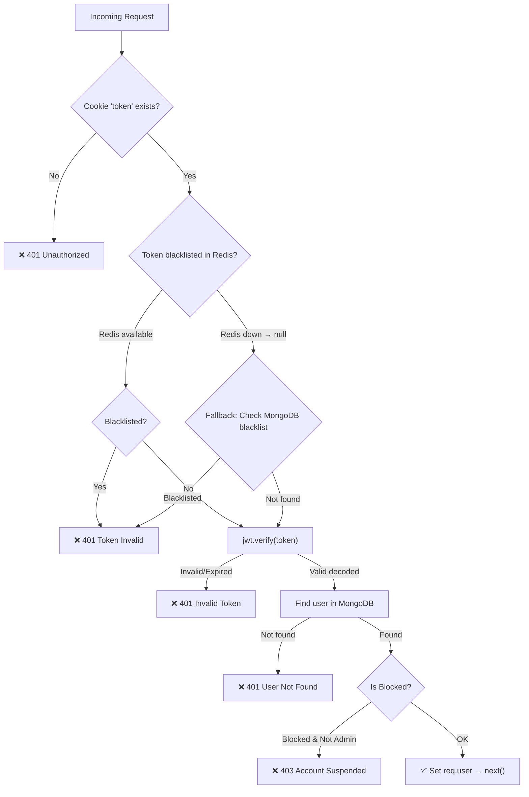

**File:** [auth.middleware.js](file:///c:/Users/Sumit/Desktop/Sumit_Data/Resume%20Generator/Backend/src/middleware/auth.middleware.js)

`req.user` object that gets set after successful authentication:
```javascript
req.user = {
    id: "65abc123...",
    username: "sumit",
    email: "sumit@example.com",
    plan: "pro",                // 'free' | 'pro' | 'premium'
    role: "user",               // 'user' | 'admin' | 'super_admin'
    isAdmin: false,
    isBlocked: false,
    customBonusCredits: 0,
    customAiBonusCredits: 0,
    blockedFeatures: {
        aiAssistant: false,
        resumeGeneration: false,
        coverLetterGeneration: false,
        interviewReports: false
    }
};
```

### 1.5 Token Blacklisting (Logout)

| Layer | TTL | Purpose |
|---|---|---|
| **Redis** | 24 hours | Fast O(1) lookup (~1ms) |
| **MongoDB (blacklist collection)** | Permanent | Fallback when Redis is down |

```
Logout → blacklistTokenInRedis(token, 86400) → blacklistModel.create({token}) → clearCookie
```

### 1.6 OTP System

| Property | Value |
|---|---|
| **Type** | 6-digit numeric code |
| **Storage** | MongoDB `otpModel` collection |
| **TTL** | 10 minutes (600 seconds, validated at verification time) |
| **Cooldown** | 2 minutes between OTP requests |
| **Used For** | Email verification, Password reset |

---

## ⏱️ 2. Rate Limiting System — Server-Side Protection

### 2.1 Architecture

```
Incoming Request
       │
       ▼
[Rate Limiter Middleware]
       │
       ├──► Try Redis: INCR ratelimit:{key} & EXPIRE {window}
       │         │
       │         ├──► Count <= Limit ──► ✅ Allow: next()
       │         └──► Count > Limit  ──► ❌ Block: 429 Too Many Requests
       │
       └──► Redis Unavailable / Down?
                 │
                 ▼
            [Fallback to In-Memory Map Store]
                 │
                 ├──► Count <= Limit ──► ✅ Allow: next()
                 └──► Count > Limit  ──► ❌ Block: 429 Too Many Requests
```

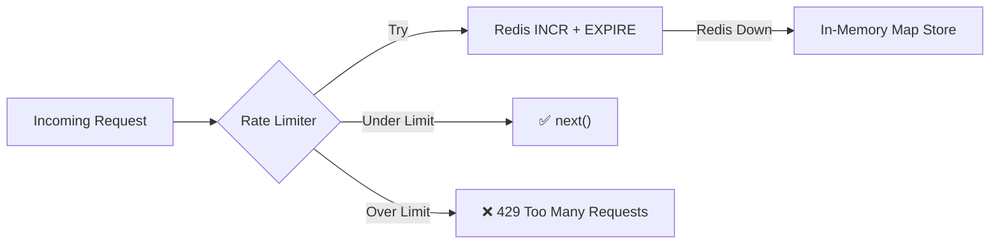

> [!TIP]
> The rate limiter follows a **fail-open** design — if both Redis **and** the in-memory store fail due to an unexpected error, the request is allowed through (`next()`).

### 2.2 All Active Rate Limiters

| Limiter | Prefix | Window | Max Requests | Scope | File |
|---|---|---|---|---|---|
| **Global** | `ratelimit:global` | 60s | 100 | Per IP | [app.js](file:///c:/Users/Sumit/Desktop/Sumit_Data/Resume%20Generator/Backend/src/app.js#L8-L13) |
| **Login** | `ratelimit:auth:login` | 60s | 5 | Per IP | [auth.route.js](file:///c:/Users/Sumit/Desktop/Sumit_Data/Resume%20Generator/Backend/src/routes/auth.route.js#L16-L21) |
| **Register** | `ratelimit:auth:register` | 60s | 5 | Per IP | [auth.route.js](file:///c:/Users/Sumit/Desktop/Sumit_Data/Resume%20Generator/Backend/src/routes/auth.route.js#L23-L28) |
| **Resend OTP** | `ratelimit:auth:resend-otp` | 60s | 3 | Per IP | [auth.route.js](file:///c:/Users/Sumit/Desktop/Sumit_Data/Resume%20Generator/Backend/src/routes/auth.route.js#L30-L35) |
| **Forgot Password** | `ratelimit:auth:forgot-password` | 60s | 3 | Per IP | [auth.route.js](file:///c:/Users/Sumit/Desktop/Sumit_Data/Resume%20Generator/Backend/src/routes/auth.route.js#L37-L42) |
| **Reset Password** | `ratelimit:auth:reset-password` | 60s | 5 | Per IP | [auth.route.js](file:///c:/Users/Sumit/Desktop/Sumit_Data/Resume%20Generator/Backend/src/routes/auth.route.js#L44-L49) |
| **Get All Reports** | `ratelimit:get-all-reports` | 60s | 50 | Per IP/User | [interview.route.js](file:///c:/Users/Sumit/Desktop/Sumit_Data/Resume%20Generator/Backend/src/routes/interview.route.js#L17-L22) |
| **Order Creation** | `ratelimit:orders:create` | 60s | 5 | Per IP/User | [order.route.js](file:///c:/Users/Sumit/Desktop/Sumit_Data/Resume%20Generator/Backend/src/routes/order.route.js#L8-L13) |
| **Cover Letter Rewrite** | `ratelimit:rewrite-cover-letter` | 60s | 5 | Per IP/User | [coverletter.route.js](file:///c:/Users/Sumit/Desktop/Sumit_Data/Resume%20Generator/Backend/src/routes/coverletter.route.js#L9-L14) |

### 2.3 Tier-Based Rate Limiters (Credit System)

| Limiter | Type | Window | Free | Pro | Premium | Storage |
|---|---|---|---|---|---|---|
| **Full Generation Credits** | Monthly | 30 days | 2 | 10 | 25 | **MongoDB** (`user.generationsUsed`) |
| **AI Assistant Credits** | Daily | 24 hours | 10 | 100 | 500 | **Redis** (ephemeral key) |

> [!IMPORTANT]
> **Generation Credits** (Interview Report + Resume + Cover Letter) are tracked in MongoDB (`user.generationsUsed` field) so that billing cycle and subscription changes remain properly synced. **AI Assistant credits** are tracked via Redis daily keys since these are short-lived daily limits.

**Atomic Increment Logic (Race-Condition Safe):**
```javascript
// MongoDB atomic increment — only increments if under limit
const updatedUser = await userModel.findOneAndUpdate(
    { _id: userId, generationsUsed: { $lt: currentMaxRequests } },
    { $inc: { generationsUsed: 1 } },
    { new: true }
);
// If updatedUser is null → limit was already reached → return 429
```

---

## 🤖 3. LLM / AI Request Handling — How AI Requests Are Processed

### 3.1 Priority Waterfall Cascade & Instant Failover Architecture

```
Incoming AI Request + User Plan (Free/Pro/Premium)
         │
         ▼
[Resolve Tier Models & Tokens (aiModels.config.js)]
         │
         ▼
[Is Groq Key 1 Available? (Date.now >= cooldownUntil)]
         │
         ├──► YES ──► 🟢 Try Groq (Key 1)
         │                 │
         │                 ├──► ✅ Success ──► Parse & Validate Output
         │                 └──► ❌ 429 Limit ──► Set Key 1 Cooldown (60s)
         │                                            │
         └──► NO (Cooling Down) ◄─────────────────────┘
                 │
                 ▼
         [Is Groq Key 2 Available?]
                 │
                 ├──► YES ──► 🟢 Try Groq (Key 2)
                 │                 │
                 │                 ├──► ✅ Success ──► Parse & Validate Output
                 │                 └──► ❌ 429 Limit ──► Set Key 2 Cooldown (60s)
                 │                                            │
                 └──► NO (Cooling Down) ◄─────────────────────┘
                         │
                         ▼
                 [Is Groq Key 3 Available?]
                         │
                         ├──► YES ──► 🟢 Try Groq (Key 3)
                         │                 │
                         │                 ├──► ✅ Success ──► Parse & Validate Output
                         │                 └──► ❌ 429 Limit ──► Set Key 3 Cooldown (60s)
                         │                                            │
                         └──► NO (Cooling Down) ◄─────────────────────┘
                                 │
                                 ▼
                         [Try Google Gemini (gemini-2.5-flash)]
                                 │
                                 ├──► ✅ Success ──► Parse & Validate Output
                                 └──► ❌ Fail / Unavailable / 401
                                             │
                                             ▼
                                     [Try OpenRouter (Nemotron 120B)]
                                             │
                                             ├──► ✅ Success ──► Parse & Validate Output
                                             └──► ❌ Fail ──► 500 Error (Auto Refund Credit)
```

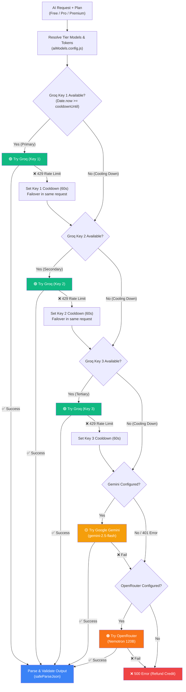

**Files:**
- [ai.service.js](file:///c:/Users/Sumit/Desktop/Sumit_Data/Resume%20Generator/Backend/src/services/ai.service.js) — Priority waterfall loop, instant failover, parser engine.
- [aiModels.config.js](file:///c:/Users/Sumit/Desktop/Sumit_Data/Resume%20Generator/Backend/src/config/aiModels.config.js) — Model mapping & parameter resolution.
- [aiKeys.config.js](file:///c:/Users/Sumit/Desktop/Sumit_Data/Resume%20Generator/Backend/src/config/aiKeys.config.js) — Independent priority array of API keys.

### 3.2 Tier-Based Model Resolution

Models are resolved dynamically based on the user's subscription plan via `aiModels.config.js`:

| Plan | Groq (Primary Priority) | Gemini (1st Fallback) | OpenRouter (2nd Fallback) | Max Output Tokens |
|---|---|---|---|---|
| **Free** | `openai/gpt-oss-120b` | `gemini-2.5-flash` | `nvidia/nemotron-3-super-120b-a12b:free` | 4096 (Report) / 1024 (Chat) |
| **Pro** | `openai/gpt-oss-120b` | `gemini-2.5-flash` | `nvidia/nemotron-3-super-120b-a12b:free` | 4096 (Groq) / 8192 (Fallback) |
| **Premium** | `openai/gpt-oss-120b` | `gemini-2.5-flash` | `nvidia/nemotron-3-super-120b-a12b:free` | 8192 (Report) / 4096 (Chat) |

### 3.3 Multi-Key Priority Pool & Cooldown Management

The key pool is isolated in `aiKeys.config.js`:
```javascript
const GROQ_API_KEYS = [
    process.env.GROQ_API_KEY,      // Key 1 (Primary Priority)
    process.env.PRINCE_GROQ_API,   // Key 2 (Secondary Priority)
    process.env.SAURABH_GROQ_API,  // Key 3 (Tertiary Priority)
];
```

* **Priority First**: Every request always starts from Key 1.
* **Instant Failover**: If Key 1 hits a 429 rate limit, it sets Key 1's `cooldownUntil` timestamp and immediately tries Key 2 in the same request.
* **Automatic Re-prioritization**: As soon as Key 1's cooldown expires (e.g. after 60s), subsequent requests instantly jump straight back to Key 1.

### 3.4 AI-Powered Features & Their LLM Calls

| Feature | Function | System Prompt Role | Output Format | Validation / Safety |
|---|---|---|---|---|
| **Interview Report** | `generateInterviewReport()` | Expert AI Interview Coach | Structured JSON | ✅ `safeParseJson` + `normalizeInterviewReport` + `mongooseInterviewReportSchema.safeParse()` |
| **Resume HTML** | `generateResumeHtml()` | Expert Resume Writer | `{"html": "..."}` JSON | ✅ `extractResumeHtmlContent` + `normalizeResumeHtmlDocument` |
| **Cover Letter** | `generateCoverLetter()` | Expert Cover Letter Writer | `{"html": "..."}` JSON | ✅ Print-ready HTML normalization |
| **AI Copilot Chat** | `rewriteResumeSection()` | KIVI AI Resume Copilot | `{"replyText": "...", "suggestedSnippet": "..."}` | ✅ Low-token assistant profile (`isAssistant: true`) |

### 3.5 Resilient LLM Response Processing Pipeline

```
Raw LLM Response String (Potentially Messy / Markdown-Wrapped)
              │
              ▼
   [safeParseJson() Sanitizer]
   • Strip markdown code fences (```json ... ```)
   • Repair unescaped quotes & trailing commas
   • Extract embedded JSON object from raw text
              │
              ▼
   [normalizeInterviewReport() Transformer]
   • sanitizeScore(): Converts "88%", "88.4", null into clean int (0-100)
   • Pad questions array to guarantee exactly 5 technical & 5 behavioral
   • Normalize skill gaps, severities, and tech tags
              │
              ▼
   [mongooseInterviewReportSchema.safeParse() Validation]
   • Non-throwing Zod validation
   • Guaranteed complete schema object
              │
              ▼
   [Save to MongoDB Database] ──► Return to Client UI
```

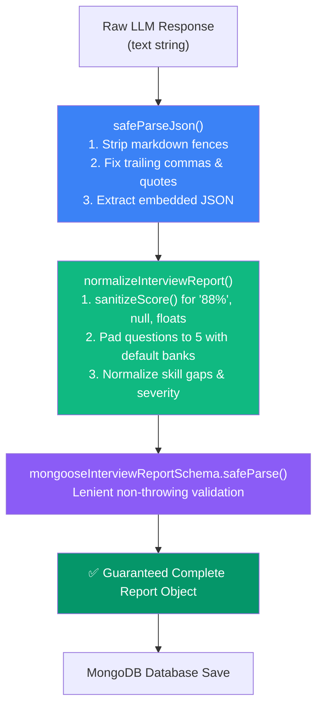

**Bulletproof Normalization Highlights:**
- **`safeParseJson()`**: Recovers from markdown wrappers (````json ... ````), trailing commas, and unescaped quotes without throwing `SyntaxError`.
- **`sanitizeScore()`**: Clamps strings like `"88%"` or `"74.6"` into clean integers (0–100).
- **Default Question Banks**: Automatically pads incomplete outputs to guarantee the UI always receives 5 technical and 5 behavioral questions.
- **Credit Refund Safeguard**: If any unexpected server error occurs, `req.refundGeneration()` automatically refunds the generation credit.

### 3.6 Global Error Handler — AI Error Detection

```javascript
// app.js — Global Error Middleware
// Gemini 503 / UNAVAILABLE / High Demand / Quota errors → User-friendly retry message
if (
    statusCode === 503 ||
    rawMessage.includes("503 Service Unavailable") ||
    rawMessage.includes("The model is overloaded") ||
    rawMessage.includes("Resource has been exhausted") ||
    rawMessage.includes("quota")
) {
    return res.status(503).json({
        message: "Our AI service is experiencing very high demand right now. Please wait a few seconds and try again.",
        retryAfterSeconds: 5
    });
}
```

**Frontend Side** — Interview API interceptor auto-detects LLM errors:
```javascript
// interview.api.js — Axios response interceptor
const isLlmBusy = status === 503 || msg.includes('high demand') || msg.includes('UNAVAILABLE');
// Shows global error toast to user with retry guidance
```

---

## 🌐 4. Complete API Route Map

### 4.1 Auth APIs (`/api/auth/`)

| Method | Route | Auth | Rate Limit | Controller | Purpose |
|---|---|---|---|---|---|
| POST | `/register` | ❌ Public | 5/min | `registerUserController` | Register + Send OTP |
| POST | `/verify-otp` | ❌ Public | — | `verifyOtpController` | Verify email OTP + Auto-login |
| POST | `/resend-otp` | ❌ Public | 3/min | `resendOtpController` | Resend verification OTP |
| POST | `/login` | ❌ Public | 5/min | `loginController` | Login + Set JWT cookie |
| POST | `/forgot-password` | ❌ Public | 3/min | `forgotPasswordController` | Send password reset OTP |
| POST | `/reset-password` | ❌ Public | 5/min | `resetPasswordController` | Verify OTP + Reset password |
| GET | `/logout` | ❌ Public | — | `logoutController` | Blacklist token + Clear cookie |
| GET | `/get-me` | ❌ Public* | — | `getMeController` | Get current session user |
| GET | `/usage` | ❌ Public* | — | `getUserUsageController` | Get generation & AI credit limits |

> *`/get-me` and `/usage` are technically public but return `null` user if no valid cookie.

### 4.2 Interview APIs (`/api/interview/`)

| Method | Route | Auth | Rate Limit | Feature Gate | Controller |
|---|---|---|---|---|---|
| POST | `/` | ✅ authUser | fullGenerationLimiter | interviewReports + resumeGeneration | `generateInterviewReportController` |
| GET | `/` | ✅ authUser | 50/min | — | `getAllInterviewReportController` |
| GET | `/report/:interviewId` | ✅ authUser | — | — | `getInterviewReportByIdController` |
| GET | `/skill-analytics` | ✅ authUser | — | — | `getSkillAnalyticsController` |
| GET | `/model-info` | ✅ authUser | — | — | `getAiModelInfoController` |
| POST | `/resume/pdf/:id` | ✅ authUser | fullGenerationLimiter | resumeGeneration | `generateResumePdfController` |
| POST | `/resume/rewrite-section` | ✅ authUser | AI Assistant Daily Limiter | aiAssistant | `rewriteResumeSectionController` |
| PUT | `/resume/:id` | ✅ authUser | — | resumeGeneration | `updateResumeHtmlController` |
| PUT | `/progress/:id` | ✅ authUser | — | — | `updateInterviewProgressController` |
| DELETE | `/:id` | ✅ authUser | — | — | `deleteReportById` |

### 4.3 Cover Letter APIs (`/api/cover-letter/`)

| Method | Route | Auth | Rate Limit | Feature Gate | Controller |
|---|---|---|---|---|---|
| POST | `/` | ✅ authUser | fullGenerationLimiter | coverLetterGeneration | `createCoverLetterController` |
| POST | `/generate-from-report/:id` | ✅ authUser | fullGenerationLimiter | coverLetterGeneration | `createCoverLetterFromReportController` |
| GET | `/` | ✅ authUser | — | — | `getAllCoverLettersController` |
| GET | `/:id` | ✅ authUser | — | — | `getCoverLetterByIdController` |
| GET | `/report/:id` | ✅ authUser | — | — | `getCoverLetterByReportIdController` |
| PUT | `/:id` | ✅ authUser | 5/min | coverLetterGeneration | `updateCoverLetterController` |
| DELETE | `/:id` | ✅ authUser | — | — | `deleteCoverLetterController` |

### 4.4 Payment & Subscription APIs

| Method | Route | Auth | Controller | Purpose |
|---|---|---|---|---|
| POST | `/api/orders/` | ✅ authUser | `OrderController.createOrder` | Create Razorpay payment order |
| GET | `/api/orders/:id` | ✅ authUser | `OrderController.getOrder` | Check order status |
| POST | `/api/webhooks/razorpay` | ❌ (HMAC verified) | `WebhookController.handleRazorpayWebhook` | Razorpay webhook events |
| GET | `/api/subscriptions/` | ✅ authUser | — | Get subscription status |
| GET | `/api/invoices/` | ✅ authUser | — | Get invoices |

---

## 💳 5. Payment & Subscription System

### 5.1 Payment Flow — End to End

```
[User Selects Plan (Pro/Premium)] ──► POST /api/orders {planKey, billingCycle}
                                            │
                                            ▼
                               [Generate Idempotency Key]
                                            │
                                            ▼
                           [Razorpay API: POST /v1/orders]
                                            │
                                            ▼
                      [Create PaymentOrder in MongoDB (CREATED)]
                                            │
                                            ▼
                     [Frontend Opens Razorpay Checkout Modal]
                                            │
                                            ▼
                         [User Pays via UPI / Card / NetBanking]
                                            │
                                            ▼
=================== WEBHOOK PROCESSING (Backend) ===================
POST /api/webhooks/razorpay (payment.captured / order.paid)
                                            │
                                            ▼
                            [Verify HMAC-SHA256 Signature]
                                            │
                                            ▼
                            [Idempotency Check (WebhookEvent)]
                                            │
                                            ▼
                            [Find PaymentOrder by gatewayOrderId]
                                            │
                                            ▼
                         [MongoDB ACID Transaction (Activation)]
                         ┌──────────────────────────────────────────────┐
                         │ 1. Create Payment record in DB               │
                         │ 2. Mark PaymentOrder status: PAID            │
                         │ 3. Cancel existing active Subscriptions      │
                         │ 4. Create new Subscription (ACTIVE)          │
                         │ 5. Update user.plan & reset generationsUsed  │
                         │ 6. Create UsageTracking row                  │
                         │ 7. Create SubscriptionEvent audit entry      │
                         │ 8. Generate Tax Invoice                      │
                         │ 9. Emit In-App Notification                  │
                         └──────────────────────┬───────────────────────┘
                                                │
                                                ▼
                                    [Return 200 OK to Razorpay]
```

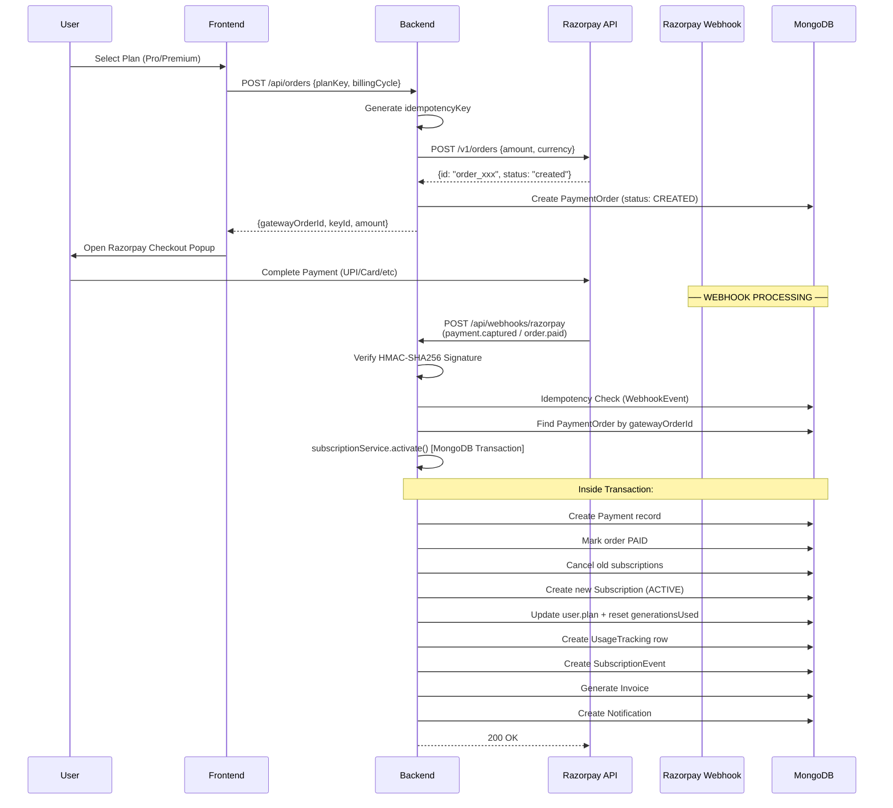

### 5.2 Webhook Security

| Security Measure | Implementation |
|---|---|
| **HMAC-SHA256 Signature** | `crypto.timingSafeEqual()` for constant-time comparison |
| **Raw Body Preservation** | `express.raw({ type: 'application/json' })` mounted **before** JSON parser |
| **Idempotency** | Compound unique index `(gateway, gatewayEventId)` in WebhookEvent model |
| **Gateway Event ID** | Required from `x-razorpay-event-id` header — rejects if missing |
| **Settled Order Guard** | Skips re-activation if order already `PAID` |

### 5.3 Subscription Plans

| Plan | Price (Monthly) | Price (Yearly) | Generations/mo | AI Credits/day |
|---|---|---|---|---|
| **Free** | ₹0 | ₹0 | 3 | 20 |
| **Pro** | ₹99 | ₹990 | 10 | 50 |
| **Premium** | ₹199 | ₹1,990 | 25 | 100 |

### 5.4 Background Cron Jobs

| Job | Interval | Purpose | File |
|---|---|---|---|
| **Order Expiry** | Every 15 min | Mark CREATED/PENDING orders as EXPIRED after 30 min | [reconciliation.service.js](file:///c:/Users/Sumit/Desktop/Sumit_Data/Resume%20Generator/Backend/src/services/reconciliation.service.js#L9-L30) |
| **Missed Webhook Reconciliation** | Every 10 min | Poll Razorpay API for orders paid 10-60 min ago that missed webhook | [reconciliation.service.js](file:///c:/Users/Sumit/Desktop/Sumit_Data/Resume%20Generator/Backend/src/services/reconciliation.service.js#L36-L110) |

---

## 🔴 6. Redis & Caching Architecture

### 6.1 Redis Uses

| Use Case | Key Pattern | TTL | Fallback |
|---|---|---|---|
| **Rate Limiting (Global/Auth)** | `ratelimit:{prefix}:{ip/userId}` | Window-based (60s/86400s) | In-Memory Map |
| **AI Assistant Credits** | `ratelimit:ai-assistant:user:{userId}` | 86400s (24hr) | In-Memory Map |
| **Token Blacklist** | `auth:blacklist:{token}` | 86400s (24hr) | MongoDB `blacklist` collection |
| **Report Cache** | `cache:report:{reportId}:{userId}` | 3600s (1hr) | Direct DB query |
| **Reports List Cache** | `cache:reports:user:{userId}` | 600s (10min) | Direct DB query |

### 6.2 Redis Failover Strategy

```
Redis Cache / Rate Limit Operation
                 │
                 ▼
     [Is Redis Connected & Ready?]
                 │
        ┌────────┴────────┐
        ▼                 ▼
     [ YES ]           [ NO ]
        │                 │
 [Execute Command]        │
        │                 │
   ┌────┴────┐            │
   ▼         ▼            │
[Success] [Error]         │
   │         │            │
   │         └─────►──────┤
   │                      ▼
   │          [Use In-Memory Map Store]
   │          (memoryStore / rateLimitMap)
   │                      │
   └──────────┬───────────┘
              │
              ▼
   [Return Result to Pipeline]
```

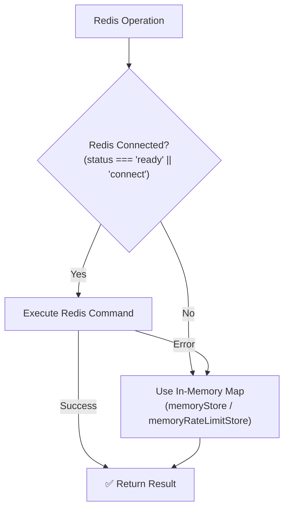

> [!NOTE]
> The Redis connection auto-detects the Railway environment (`REDISHOST`, `REDIS_URL`, `REDIS_PUBLIC_URL`). In local development, Docker Redis (`redis://127.0.0.1:6379`) is used. When Redis is completely unavailable, in-memory `Map()` objects provide the fallback — the application does not crash.

---

## 📧 7. Email Service Architecture (SOLID Design)

```
sendOtpEmail(recipientEmail, otpCode)
                 │
                 ▼
    [EmailService._resolveProvider()]
                 │
                 ▼
       [Is BREVO_API_KEY set?]
                 │
        ┌────────┴────────┐
        ▼ YES             ▼ NO
[🥇 BrevoApiProvider]   [Are EMAIL_USER + EMAIL_PASS set?]
 (POST api.brevo.com)             │
                         ┌────────┴────────┐
                         ▼ YES             ▼ NO
                 [🥈 GmailSmtpProvider]  [🥉 ConsoleFallback]
                   (nodemailer SMTP)       (console.log OTP)
```

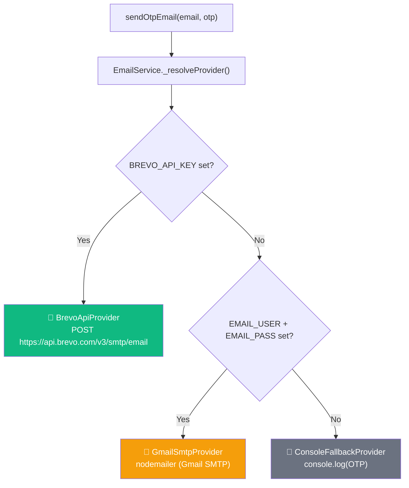

**File:** [email.service.js](file:///c:/Users/Sumit/Desktop/Sumit_Data/Resume%20Generator/Backend/src/services/email.service.js)

- Uses **SOLID OCP (Open-Closed Principle)** — new providers can be added without modifying existing code
- Each provider implements `EmailProvider.sendOtp()` interface
- Beautiful HTML email template embedded in base class

---

## 🔄 8. Frontend → Backend Request Pipeline (Complete)

### 8.1 Axios Configuration

```javascript
// Frontend: auth.api.js
const API_BASE_URL = import.meta.env.VITE_API_BASE_URL || "https://kivi-ai-production.up.railway.app";
const api = axios.create({
    baseURL: `${API_BASE_URL}/api/auth/`,
    withCredentials: true    // ✅ Send cookies with every request
});
```

### 8.2 Complete Request Lifecycle

```
[Frontend UI: React Component]
        │
        ├──► React Hook (useInterview / useAuth)
        └──► Axios Instance (withCredentials: true)
                    │
                    ▼
[Backend Express Middleware Pipeline]
        │
        ├── 1️⃣ CORS Security Check
        ├── 2️⃣ express.raw() (Webhooks) / express.json() (REST)
        ├── 3️⃣ cookieParser() (Extract HttpOnly token)
        ├── 4️⃣ Global Rate Limiter (100 req/min per IP)
        ├── 5️⃣ Route-Specific Limiter (e.g. 5/min on Auth)
        ├── 6️⃣ authUser Middleware (JWT verification + load user)
        ├── 7️⃣ Feature Access Gate (Check blockedFeatures)
        ├── 8️⃣ Tier Credit Limiter (Atomic MongoDB $inc)
        └── 9️⃣ Multer File Upload (PDF memory parsing, max 3MB)
                    │
                    ▼
[Controller & Business Services]
        │
        ├── Validate Input Parameters
        ├── Parse PDF (pdf-parse)
        ├── AI Service (Groq 1/2/3 → Gemini → OpenRouter)
        ├── Save to MongoDB Atlas
        └── Invalidate / Refresh Redis Cache
                    │
                    ▼
[Response to Frontend] ──► Axios Response Interceptor ──► Update UI State
```

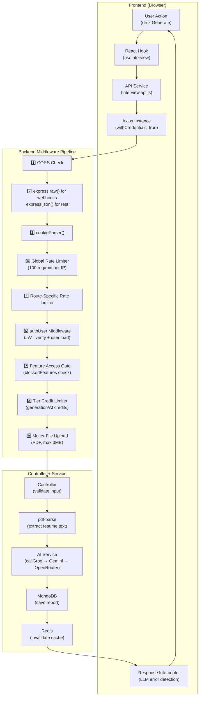

---

## 📊 9. Database Models Summary

| Model | Collection | Key Fields | Purpose |
|---|---|---|---|
| **User** | `users` | username, email, password, plan, role, isBlocked, generationsUsed, generationsResetAt, blockedFeatures | Core user account |
| **OTP** | `otps` | email, otp, createdAt (TTL index) | Email verification & password reset |
| **Blacklist** | `blacklists` | token | Logged-out JWT tokens |
| **InterviewReport** | `interviewreports` | user, resume, matchScore, technicalQuestions[5], behavioralQuestion[5], skillGaps, detectedSkills, preparationPlan, generatedResumeHtml | AI-generated interview analysis |
| **CoverLetter** | `coverletters` | user, interviewReport, resume, generatedContent (HTML) | AI-generated cover letters |
| **Subscription** | `subscriptions` | userId, plan, status, billingCycle, currentPeriodStart/End | Active subscription tracking |
| **SubscriptionPlan** | `subscriptionplans` | planKey, name, rank, price, generationLimit, aiCreditsLimit | Plan configuration (DB-driven) |
| **PaymentOrder** | `paymentorders` | userId, planKey, amount, gatewayOrderId, status, idempotencyKey | Razorpay order tracking |
| **Payment** | `payments` | orderId, userId, gatewayPaymentId, amount, status, paymentMethod | Payment settlement records |
| **Refund** | `refunds` | paymentId, gatewayRefundId, amount, status | Razorpay refund tracking |
| **Invoice** | `invoices` | userId, invoiceNumber, amount, gst details | Tax invoice documents |
| **WebhookEvent** | `webhookevents` | gateway, gatewayEventId (unique), eventType, processingStatus | Razorpay webhook dedup & audit |
| **SubscriptionEvent** | `subscriptionevents` | userId, eventType (ACTIVATED/UPGRADED/RENEWED), fromPlan, toPlan | Subscription lifecycle audit |
| **UsageTracking** | `usagetrackings` | userId, subscriptionId, interviewsUsed/Limit, aiCreditsUsed/Limit | Billing period usage tracking |
| **Notification** | `notifications` | recipient, title, message, type, isRead | In-app notification system |
| **Admin** | `admins` | username, email, password | Separate admin accounts |

---

## 🔑 10. Environment Variables (Required Keys)

| Variable | Service | Purpose |
|---|---|---|
| `MONGO_URI` | MongoDB | Database connection string |
| `JWT_SECRET` | Auth | JWT signing key |
| `GROQ_API_KEY` | Groq | Primary LLM provider |
| `GOOGLE_GENAI_API_KEY` | Gemini | 1st fallback LLM |
| `OPENROUTER_API_KEY` | OpenRouter | 2nd fallback LLM |
| `RAZORPAY_KEY_ID` | Razorpay | Payment gateway key |
| `RAZORPAY_KEY_SECRET` | Razorpay | Payment gateway secret |
| `RAZORPAY_WEBHOOK_SECRET` | Razorpay | Webhook HMAC verification |
| `BREVO_API_KEY` | Brevo | Email delivery |
| `EMAIL_USER` / `EMAIL_PASS` | Gmail | SMTP fallback email |
| `REDIS_URL` / `REDISHOST` | Redis | Cache & rate limiting |
| `CORS_ORIGIN` | Express | Allowed frontend origins |
| `VITE_API_BASE_URL` | Frontend | Backend API base URL |

---

## ⚡ 11. Key Highlights & Design Decisions

### ✅ What's Working Well

| Feature | Implementation |
|---|---|
| **Multi-LLM Failover** | Groq → Gemini → OpenRouter chain with 5-min health cooldown |
| **Cookie-Based Auth** | HttpOnly + Secure + SameSite — no token exposed to JS |
| **Dual Blacklist** | Redis (fast, 1ms) + MongoDB (durable fallback) |
| **Atomic Credit Deduction** | MongoDB `findOneAndUpdate` with `$lt` guard — no race conditions |
| **Webhook Idempotency** | Compound unique index on `(gateway, gatewayEventId)` — duplicate events silently dropped |
| **MongoDB Transactions** | Subscription activation runs in a full ACID transaction (session.withTransaction) |
| **Reconciliation Job** | Background cron catches missed webhooks by polling Razorpay API |
| **Redis Graceful Degradation** | Falls back to in-memory Map when Redis is unavailable |
| **SOLID Email System** | Provider pattern — Brevo → Gmail → Console with zero code changes needed |
| **Zod Schema Validation** | AI responses validated against strict schemas before DB storage |
| **LLM Response Normalization** | Handles field aliases, nested JSON strings, markdown fences — very resilient |

### 🏗️ Architecture Pattern

```
Frontend (Vite + React)
    ↓ Axios + HttpOnly Cookie
Backend (Express.js)
    ├── Middleware Pipeline: CORS → JSON → Cookie → GlobalRateLimit → RouteRateLimit → Auth → FeatureGate → TierLimiter → Upload
    ├── Controllers: Validate → Call Service → Respond
    ├── Services: AI (Multi-LLM), Email (Multi-Provider), Payment (Razorpay), Subscription, Redis
    ├── Models: Mongoose ODM → MongoDB Atlas
    └── Background: Cron Jobs (Order Expiry + Reconciliation)
```

---

## 🧠 12. AI Assistant Architecture: Agentic Memory, Real-Time Search & Analytics Pipeline

### 12.1 End-to-End System Architecture (Visual Box Diagram)

```
                  ┌─────────────────────────────────────┐
                  │           User Interaction          │
                  │        (React Candidate SPA)        │
                  └──────────────────┬──────────────────┘
                                     │ 1. Sends Query / Message
                                     ▼
        ┌────────────────────────────────────────────────────────┐
        │                 CONTEXT ASSEMBLER                      │
        │  • Fetch Active Session & History  ──► (from Redis)    │
        │  • Fetch Candidate Profile/KeyInfo ──► (from MongoDB)  │
        └────────────────────────────┬───────────────────────────┘
                                     │ 2. Enriched Prompt + Memory
                                     ▼
                        ┌────────────────────────┐
                        │      AI Assistant      │
                        │    (Decision Router)   │
                        └────────────┬───────────┘
                                     │
           ┌─────────────────────────┴────────────────────────┐
           ▼ (Need Live Web / Docs / Video)                   ▼ (Direct Answer)
   ┌───────────────┐                                          │
   │  Search Tool  │ ◄─── (Check Redis Cache first,           │
   │  (Web/Tavily/ │       else fetch live API &              │
   │  YouTube API) │       cache for 24 hours)                │
   └───────┬───────┘                                          │
           │                                                  │
           └─────────────────────────┬────────────────────────┘
                                     │
                                     ▼
                        ┌────────────────────────┐
                        │      LLM Response      │
                        │ (Streamed to User UI)  │
                        └────────────┬───────────┘
                                     │
                                     ▼ (Async / Non-blocking Background)
                        ┌────────────────────────┐
                        │  Key Point Extractor   │
                        │ (Structured JSON Gen)  │
                        └────────────┬───────────┘
                                     │
                   ┌─────────────────┴─────────────────┐
                   ▼                                   ▼
          Update MongoDB                      Update Redis
   (Profile, Skills Matrix, Analytics)    (Chat Session Memory Buffer)
```

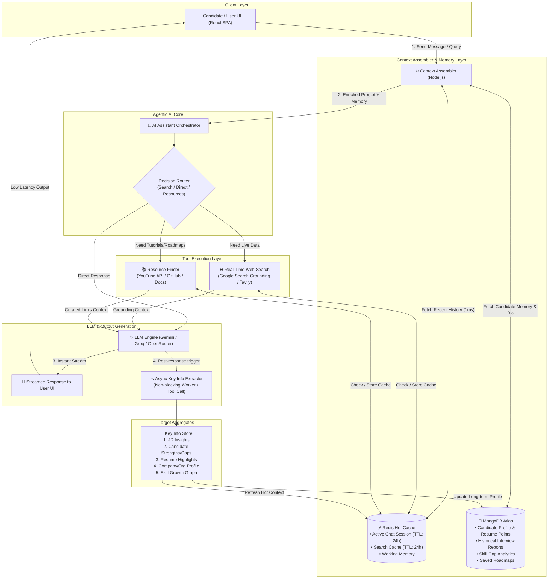

---

### 12.2 Flowchart: AI Decision & Tool Routing Logic

```
   [User Message] ──► [Backend Context Assembler]
                              │
                              ▼
                   [Evaluate Tool Necessity]
                              │
         ┌────────────────────┼────────────────────┐
         │                    │                    │
         ▼                    ▼                    ▼
[Needs Web Search]    [Needs Resources]    [Direct Answer]
         │                    │                    │
  (Redis Cache?)       (Redis Cache?)              │
   ├─► Hit: Use Cache   ├─► Hit: Use Cache         │
   └─► Miss: Call API   └─► Miss: Call API         │
         │                    │                    │
         └────────────────────┼────────────────────┘
                              │
                              ▼
                  [Stream Response to User]
                              │
                              ▼ (Async Worker)
                 [Extract Key Facts / Scores]
                              │
         ┌────────────────────┴────────────────────┐
         ▼                                         ▼
[MongoDB: Profile & Growth Graph]        [Redis: Session Buffer]
```

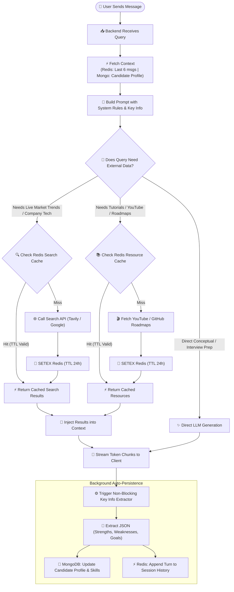

---

### 12.3 Flowchart: Data Storage & Retrieval (Read vs Write Paths)

```
========================= READ PATH (Sub-10ms) =========================
User Query ──► Context Assembler
                    │
                    ├──► Redis: GET chat:uid:sid (Last 6 turns)  [0.5ms]
                    └──► Mongo: FIND userProfile (Skills & Bio)   [5ms]
                    │
                    ▼
           Merged System Prompt ──► LLM Inference Engine

========================= WRITE PATH (Async) ==========================
LLM Inference Complete ──► Stream to UI immediately (Zero user wait)
         │
         └─► Background Worker
                 │
                 ├──► MongoDB: $set / $addToSet (Skills, Score, Reports)
                 └──► Redis: RPUSH chat:uid:sid + EXPIRE 86400
```

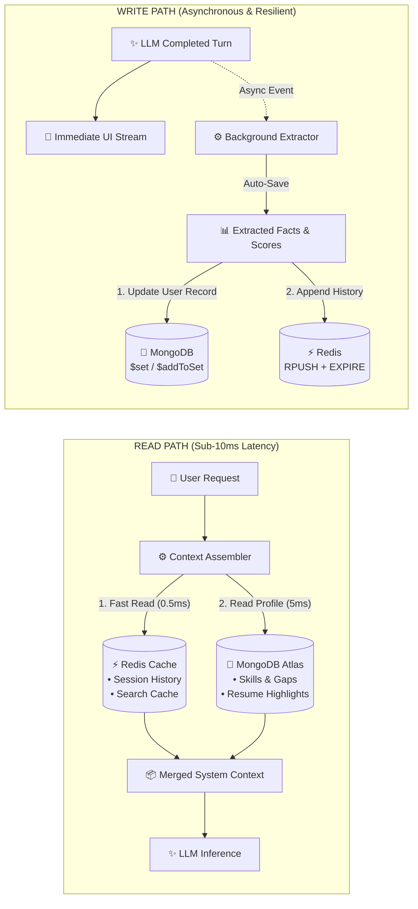

---

### 12.4 Flowchart: Web Search & Resource Caching Pipeline

```
Search Query ──► Generate SHA256 Hash ──► Check Redis Key (search:hash)
                                                │
                     ┌──────────────────────────┴──────────────────────────┐
                     ▼                                                     ▼
              [CACHE HIT]                                            [CACHE MISS]
         Return in < 1ms (0 API Cost)                              Fetch Live API
                     │                                                     │
                     │                                      ┌──────────────┴──────────────┐
                     │                                      ▼                             ▼
                     │                                [Web / Tavily]               [YouTube Data API]
                     │                                      │                             │
                     │                                      └──────────────┬──────────────┘
                     │                                                     │
                     │                                           Save in Redis (TTL 24h)
                     │                                                     │
                     └──────────────────────────┬──────────────────────────┘
                                                │
                                                ▼
                                   Format & Inject into Context
```

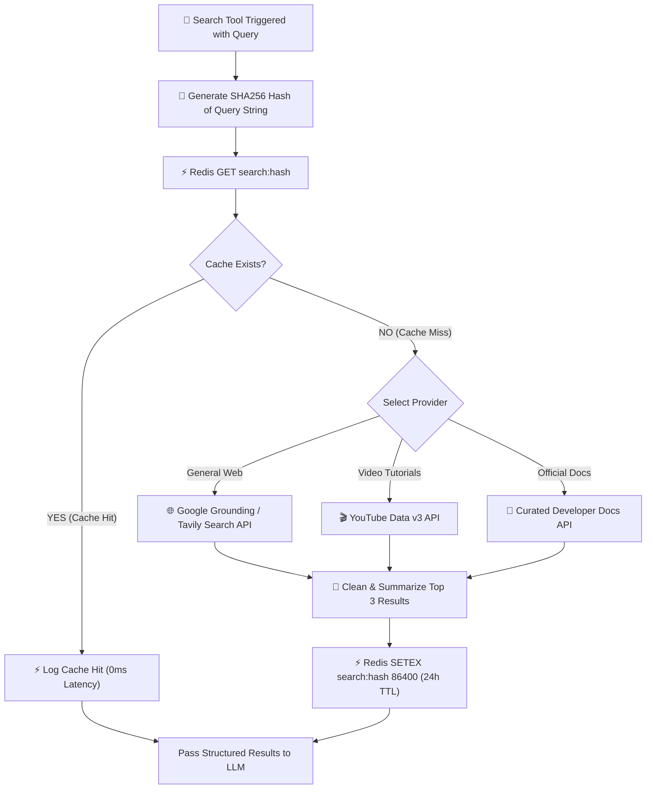

---

### 12.5 Flowchart: Analytics Page & Skill Growth Feedback Loop

```
┌────────────────────────────────────────────────────────┐
│                   INTERACTION CHANNELS                 │
│  • AI Mock Interviews  • Code Reviews  • Assistant Q&A │
└───────────────────────────┬────────────────────────────┘
                            │
                            ▼
┌────────────────────────────────────────────────────────┐
│                  DATA AGGREGATION                      │
│   • Performance Score (0-100%)                         │
│   • Skill Matrix (Strong vs Gaps)                      │
│   • Milestone Progress Timeline                        │
└───────────────────────────┬────────────────────────────┘
                            │
                            ▼
┌────────────────────────────────────────────────────────┐
│                 PERSISTENCE (MongoDB)                  │
│       Saved under `UserMemory` & `InterviewReport`     │
└───────────────────────────┬────────────────────────────┘
                            │
                            ▼
┌────────────────────────────────────────────────────────┐
│               ANALYTICS DASHBOARD (UI)                 │
│  ┌──────────────────────┐    ┌──────────────────────┐  │
│  │   Skill Radar Chart  │    │ Growth Timeline Plot │  │
│  └──────────────────────┘    └──────────────────────┘  │
│  ┌──────────────────────────────────────────────────┐  │
│  │         AI Recommended Action Plan               │  │
│  └──────────────────────────────────────────────────┘  │
└───────────────────────────┬────────────────────────────┘
                            │
                            ▼ (Loop Back)
              Proactive Coaching in AI Assistant
```

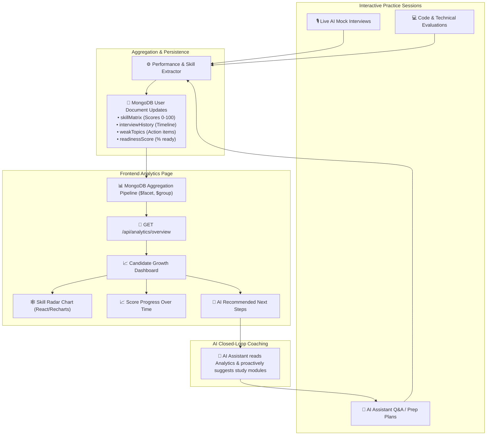

---

### 12.6 Request Execution Sequence Diagram

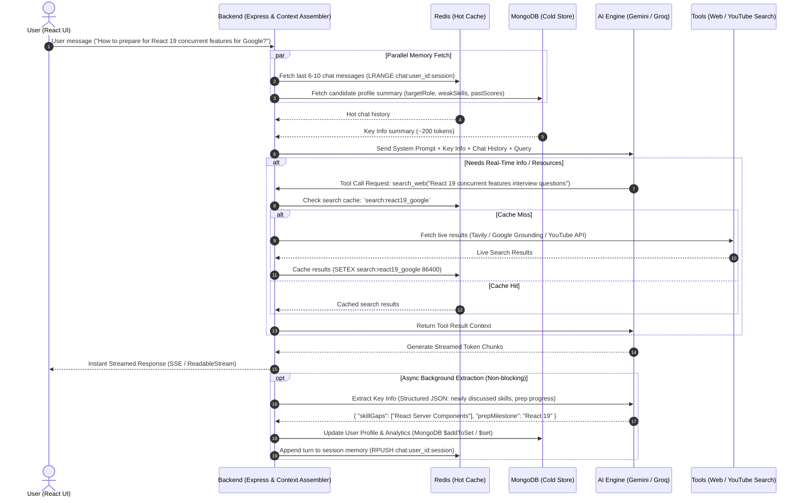

---

### 12.7 Storage Matrix — Redis vs. MongoDB

| Layer | Technology | Data Stored | TTL / Lifecycle | Purpose |
|---|---|---|---|---|
| **Hot Working Memory** | **Redis** | • Active Chat Messages (`chat:uid:sid`)<br/>• Search Cache (`search:query_hash`)<br/>• Active session state (current question/timer) | 24 Hours (`EXPIRE 86400`) | Sub-millisecond latency; prevents re-querying expensive Search APIs and database on every chat turn. |
| **Persistent Intelligence** | **MongoDB** | • Consolidated Candidate Profile (`UserMemory`)<br/>• Historical Interview Reports & Scores (`InterviewReport`)<br/>• Skill Gap Metrics & Radar Chart Points<br/>• Bookmarked Learning Resources | Permanent (Durable) | Drives the Candidate Analytics & Skill Growth page, historical reporting, and personalized roadmap generation. |

---

### 12.8 Key Info Categories Extracted by AI

The AI dynamically maintains 5 core context vectors without bloating token count:

1. **Job Description (JD) Focus:** Target role level (e.g., SDE-2, Staff), primary tech stack requirements, required soft skills.
2. **Candidate Attributes:** Identified strengths, technical blindspots, communication rating, and past practice scores.
3. **Resume Highlights:** Projects, experience tenure, and verified technologies from the uploaded PDF.
4. **Company / Organization Context:** Company interview patterns (e.g., Google DSA style vs. Startup full-stack system design).
5. **Growth & Analytics:** Session-over-session score progress, skill radar levels (0–100%), and completed roadmap milestones.


### Redis Future Inhancement.

1. Actual Reality: TTL & Active Users
Sabhi 10,000 users ek hi ghante me online nahi honge:
Report cache ka TTL 1 ghanta (3,600s) hai.
Agar kisi din 10,000 total users hain, to ek given 1 ghante me active users usually ~200–500 hote hain.
$500 \text{ users} \times 5 \text{ reports} \times 50\text{ KB} \approx \mathbf{125 \text{ MB}}$ RAM hi active rahegi.
Auto-Expiry: 1 ghante baad inactive users ka data Redis memory se automatically delete (free) ho jata hai.
2. 50 KB me se sabse heavy kya hai?
Ek report me 70–80% weight sirf 2 fields ka hota hai:

generatedResumeHtml (~20 KB)
resume raw plain text (~10 KB)
jobDescription raw text (~10 KB)
Jabki UI par questions aur score dikhane ke liye sirf ~5 KB data kaafi hota hai.

3. Production Scaling Optimizations (Agar RAM bachani ho)
Agar 10,000+ active users ho jayein aur Redis memory low rakhni ho:

Optimization Technique	Pehle	Optimization ke baad	Fayda
1. Strip Heavy HTML/Raw Text from Cache
HTML ko MongoDB me hi rehne do, Redis me sirf questions + score rakho	50 KB	~6 KB	2.5 GB $\rightarrow$ 300 MB
2. Gzip JSON Compression (zlib)
Redis me save karte waqt gzip compress karo	50 KB	~8 KB	2.5 GB $\rightarrow$ 400 MB
3. Redis Eviction Policy (volatile-lru)
Agar 512MB RAM bhar jaye to Redis purane inactive reports automatically nikal deta hai aur MongoDB fallback chalta hai.	Memory Overflow	0% Crash Risk	Free Plan par bhi chal jata hai
💡 Conclusion:
Current architecture is safe kyunki 1-hour TTL ki wajah se memory leak nahi hoti.
Future me agar memory badhti hai, to simply heavy generatedResumeHtml ko Redis cache se exclude karke ya gzip laga kar 90% RAM save ki ja sakti hai.
